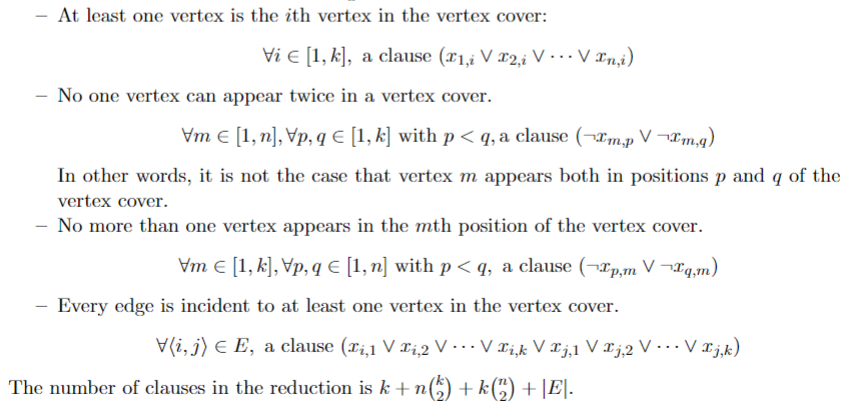
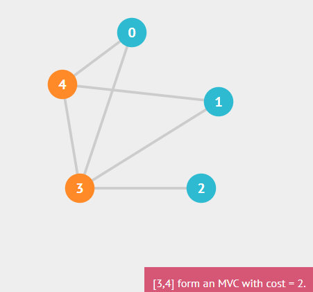

# Minimum_Vertex_Cover

## Purpose
Solve the Minimum Vertex Cover problem for an undirected graph using a polynomial time reduction to CNF-SAT with the use of a SAT solver. 

## Definitions
**Undirected Graph:** a set of objects (called vertices or nodes) that are connected together, where all the edges are bidirectional.

**Vertice:** the fundamental unit by which graphs are formed.

**Edge:** a bidirectional line which connects an unordered pair of vertices together.

**Minimum Vertex Cover:** the smallest possible subset of vertices of an undirected graph such that every edge in the graph has at least one endpoint in the vertex cover.

## Encoding


**_Note:_** _encoding provided by the University of Waterloo, Department of Electrical and Computer Engineering, Reza Babaee/Arie Gurfinkel_


## Project Setup
Clone the MiniSAT repository into the top level directory of the project using:
```
git clone https://github.com/agurfinkel/minisat.git
```
Install CMake:
```
sudo apt install cmake
```
To initiate the build sequence from scratch, use:
```
$ cd Minimum_Vertex_Cover && mkdir build && cd build && cmake ../ && make
```
To run the program:
```
$ cd Minimum_Vertex_Cover/build/
./Min_VC
```

## Commands
To specify the maximum number of vertices in the graph: 
```
V 5
```
To specify the edge list for the graph: 
```
E {<0,4>,<4,1>,<0,3>,<3,4>,<3,2>,<1,3>}
```

## Example
**Input:**
```
V 5
E {<0,4>,<4,1>,<0,3>,<3,4>,<3,2>,<1,3>}
```
**Output:**
```
3 4
```
**Graphical Representation:**



**_Note:_** _graphed using VisualGO:_ https://visualgo.net/en/mvc
